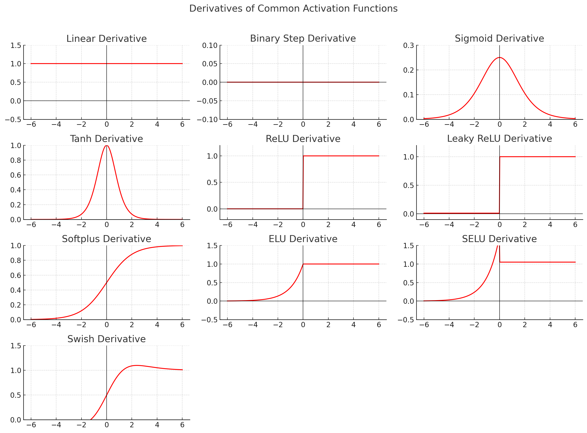

# Common Activation Functions

This is a **comprehensive, beginner-friendly table** summarizing the **most common activation
functions** used in neural networks.
Each row shows the **name**, **mathematical equation**, **derivative**, **output range**, and **typical usage** (
regression/classification).

---

### 🔢 Common Activation Functions

| **Name**                             | **Equation** ( f(x) )                                                             | **Derivative** ( f'(x) )                                                                          | **Range**            | **Common Usage**                                         |
|--------------------------------------|-----------------------------------------------------------------------------------|---------------------------------------------------------------------------------------------------|----------------------|----------------------------------------------------------|
| **1. Linear (Identity)**             | $ f(x) = x $                                                                      | $ f'(x) = 1 $                                                                                     | $(-\infty, +\infty)$ | Output layer for **regression**                          |
| **2. Binary Step (Threshold)**       | $ f(x) = \begin{cases}1 & x \ge 0 \\ 0 & x < 0 \end{cases} $                      | Not differentiable                                                                                | ${0, 1}$             | Simple logic gates, **no learning** (used in perceptron) |
| **3. Sigmoid (Logistic)**            | $ f(x) = \frac{1}{1 + e^{-x}} $                                                   | $ f'(x) = f(x)(1 - f(x)) $                                                                        | $(0, 1)$             | **Binary classification**, hidden layers (older models)  |
| **4. Tanh (Hyperbolic Tangent)**     | $ f(x) = \tanh(x) = \frac{e^x - e^{-x}}{e^x + e^{-x}} $                           | $ f'(x) = 1 - f(x)^2 $                                                                            | $(-1, 1)$            | Hidden layers (centers around 0, better than sigmoid)    |
| **5. ReLU (Rectified Linear Unit)**  | $ f(x) = \max(0, x) $                                                             | $ f'(x) = \begin{cases}1 & x > 0 \\ 0 & x \le 0\end{cases} $                                      | $[0, ∞)$             | Most common for **hidden layers** (deep learning)        |
| **6. Leaky ReLU**                    | $ f(x) = \begin{cases}x & x > 0 \\ \alpha x & x \le 0\end{cases} $                | $ f'(x) = \begin{cases}1 & x > 0 \\ \alpha & x \le 0\end{cases} $                                 | $(-∞, ∞)$            | Hidden layers (solves "dead ReLU" problem)               |
| **7. Parametric ReLU (PReLU)**       | $ f(x) = \begin{cases}x & x > 0 \\ a x & x \le 0\end{cases} $                     | Same as above (a is learned)                                                                      | $(-∞, ∞)$            | Hidden layers (adaptive negative slope)                  |
| **8. Softplus**                      | $ f(x) = \ln(1 + e^x) $                                                           | $ f'(x) = \frac{1}{1 + e^{-x}} = \text{sigmoid}(x) $                                              | $(0, ∞)$             | Smooth version of ReLU                                   |
| **9. ELU (Exponential Linear Unit)** | $ f(x) = \begin{cases}x & x > 0 \\ \alpha(e^x - 1) & x \le 0\end{cases} $         | $ f'(x) = \begin{cases}1 & x > 0 \\ f(x) + \alpha & x \le 0\end{cases} $                          | $(-α, ∞)$            | Hidden layers (smooth and avoids dead neurons)           |
| **10. SELU (Scaled ELU)**            | $ f(x) = \lambda \begin{cases}x & x > 0 \\ \alpha(e^x - 1) & x \le 0\end{cases} $ | $ f'(x) = \lambda \begin{cases}1 & x > 0 \\ f(x) + \alpha & x \le 0\end{cases} $                  | $(-λ·α, ∞)$          | **Self-normalizing networks** (advanced deep nets)       |
| **11. Softmax**                      | $ f(x_i) = \frac{e^{x_i}}{\sum_j e^{x_j}} $                                       | $ f'(x_i) = f(x_i)(1 - f(x_i)) $ (for each class)                                                 | $(0, 1)$, sums to 1  | Output layer for **multi-class classification**          |
| **12. Swish**                        | $ f(x) = x \cdot \sigma(x) = \frac{x}{1 + e^{-x}} $                               | $ f'(x) = f(x) + \sigma(x)(1 - f(x)) $                                                            | $(-∞, ∞)$            | Hidden layers (smooth & performs well)                   |
| **13. Mish**                         | $ f(x) = x \tanh(\ln(1 + e^x)) $                                                  | $ f'(x) = \tanh(\text{softplus}(x)) + x \cdot \text{sech}^2(\text{softplus}(x)) \cdot \sigma(x) $ | $(-∞, ∞)$            | Hidden layers (newer, smooth like Swish)                 |
| **14. Gaussian (Radial Basis)**      | $ f(x) = e^{-x^2} $                                                               | $ f'(x) = -2x e^{-x^2} $                                                                          | $(0, 1]$             | Used in **RBF networks**                                 |
| **15. Exponential Linear (ExpLU)**   | $ f(x) = e^x - 1 $                                                                | $ f'(x) = e^x $                                                                                   | $(-1, ∞)$            | Rare, sometimes used in experimental deep nets           |

---

### 🧭 Quick Guide: Which to Use?

| **Goal**                                      | **Recommended Activation**             |
|-----------------------------------------------|----------------------------------------|
| Regression output                             | **Linear**                             |
| Binary classification output                  | **Sigmoid**                            |
| Multi-class classification output             | **Softmax**                            |
| Hidden layers (most networks)                 | **ReLU**, **Leaky ReLU**, or **Swish** |
| When input varies a lot / needs normalization | **SELU** or **ELU**                    |

---

### Visual comparison of the most common **activation functions** —

you can see how each one transforms input
values:

* **Linear** is a straight line (no activation).
* **Binary Step** sharply switches between 0 and 1.
* **Sigmoid** smoothly transitions from 0 to 1.
* **Tanh** is similar but ranges from -1 to 1.
* **ReLU** outputs 0 for negatives and linear for positives.
* **Leaky ReLU** allows small negative values.
* **Softplus** is a smooth version of ReLU.
* **ELU**, **SELU**, and **Swish** combine smoothness with nonlinearity for better gradient flow.

---

### **comparison of derivatives** for the same activation functions:

You can see how each derivative behaves — for example:

* **Sigmoid** and **tanh** derivatives peak in the center but vanish at the extremes (causing vanishing gradients).
* **ReLU** has a constant derivative (1 for x>0, 0 for x<0), making it efficient for deep networks.
* **Leaky ReLU**, **ELU**, and **Swish** maintain small gradients even for negative inputs, helping learning stability.

---

